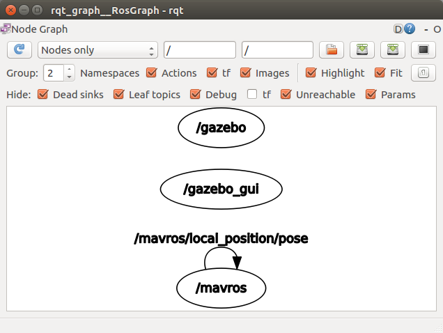
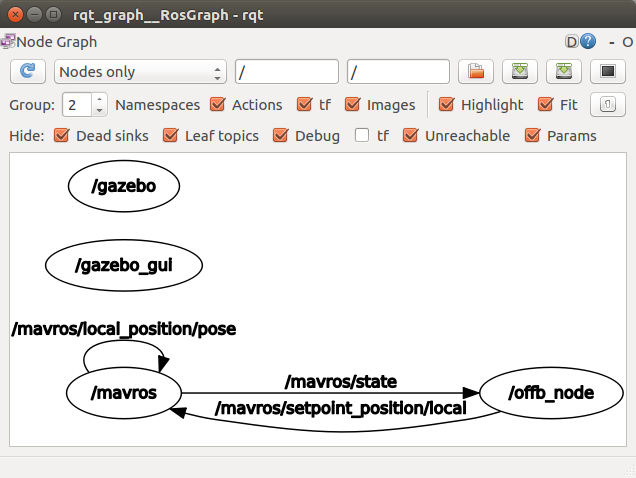
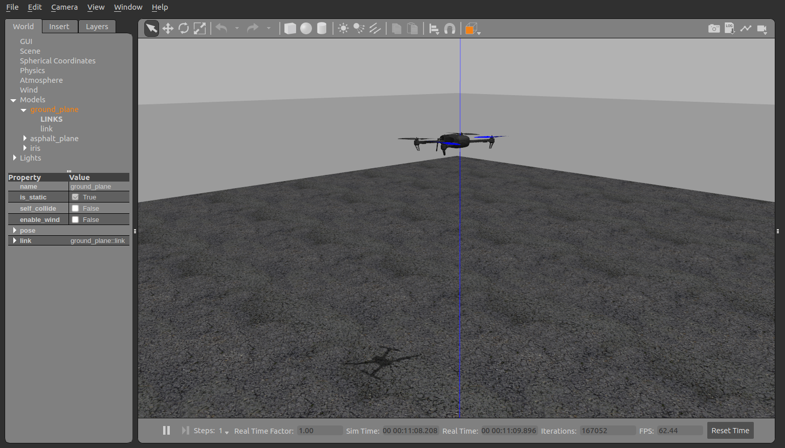

# Overview

This is a general setup guide for getting ROS and PX4 setup on your computer. This code uses:

- Ubuntu 16.04 LTS
- ROS Kinetic
- Gazebo 9
- PX4
- catkin (not catkin_make!)

# Setup

## 1. Install Ubuntu 16.04 LTS onto your computer

http://releases.ubuntu.com/16.04/

## 2. Install ROS Kinetic

http://wiki.ros.org/kinetic/Installation/Ubuntu


## 3. Uninstall Gazebo ROS packages

**Sources**: 
- https://community.gazebosim.org/t/all-about-gazebo-9-with-ros/187
- http://gazebosim.org/tutorials/?tut=ros_wrapper_versions

PX4 uses Gazebo 9 in their install scripts but Kinetic uses Gazebo 7 by default. Run this command:

```
sudo apt-get remove ros-kinetic-gazebo*
```

Now, add the osrfoundation repo to your Linux package:

```
sudo sh -c ‘echo “deb http://packages.osrfoundation.org/gazebo/ubuntu-stable lsb_release -cs main” > /etc/apt/sources.list.d/gazebo-stable.list’

wget http://packages.osrfoundation.org/gazebo.key -O - | sudo apt-key add -
```

Update the repo of packages:

```
sudo apt-get update
```

Now install the Gazebo 9 ROS packages:

```
sudo apt-get install ros-kinetic-gazebo9-*
```

Check that it everything runs with:

```
gazebo
```

### Another way

Alternatively, you can follow this guide to manually install ROS packages one-by-one: https://medium.com/@abhiksingla10/setting-up-ros-kinetic-and-gazebo-8-or-9-70f2231af21a


## 4. Get PX4/Firmware dependencies

Since we are using ROS Kinetic, we can't use the install script provided by PX4 (which uses Melodic). So we'll go step by step.

First, follow the instructions here: http://dev.px4.io/master/en/setup/dev_env_linux_ubuntu.html#sim_nuttx. Basically, download `ubuntu.sh` and run it for all the dependencies

Again, we'll set up the ROS stuff later, so just run the `ubuntu.sh` stuff.

## 5. MAVROS

You can read up about it here: https://dev.px4.io/master/en/ros/mavros_installation.html. Use those instructions to install all your stuff.

## 6. Building PX4 Software

Now, we need to build the PX4/Firmware. Follow the instructions in this tutorial until the start of "NuttX / Pixhawk Based Boards": https://dev.px4.io/master/en/setup/building_px4.html

## 7. Initial Simulation

We should have everything we need to start a simulation now. Run through the tutorial here: https://dev.px4.io/master/en/simulation/ros_interface.html#launching-gazebo-with-ros-wrappers. TLDR, run these commands:

```
cd <Firmware_clone>
DONT_RUN=1 make px4_sitl_default gazebo
source ~/catkin_ws/devel/setup.bash    # (optional)
source Tools/setup_gazebo.bash $(pwd) $(pwd)/build/px4_sitl_default
export ROS_PACKAGE_PATH=$ROS_PACKAGE_PATH:$(pwd)
export ROS_PACKAGE_PATH=$ROS_PACKAGE_PATH:$(pwd)/Tools/sitl_gazebo
roslaunch px4 mavros_posix_sitl.launch
```

When all this is done, you should have mavros and the simulator running. Let's ensure that everything is working correctly. In another terminal, run

```
rqt_graph
```

`rqt_graph` is a way to see how all the ROS nodes are connected/communicating with each other. You should have something like this:



## 8. First flight

All right, now we're ready for our first flight. Add the `ros/bee_test` to your catkin workspace. I have a brief tutorial on how to symlink the folder into your workspace [here](ros/README.md).

If you haven't already, compile your workspace:

```
catkin build
```

Now we're ready to fly! Run the commands outlined in Step 7:

```
cd <Firmware_clone>
DONT_RUN=1 make px4_sitl_default gazebo
source ~/catkin_ws/devel/setup.bash    # (optional)
source Tools/setup_gazebo.bash $(pwd) $(pwd)/build/px4_sitl_default
export ROS_PACKAGE_PATH=$ROS_PACKAGE_PATH:$(pwd)
export ROS_PACKAGE_PATH=$ROS_PACKAGE_PATH:$(pwd)/Tools/sitl_gazebo
roslaunch px4 mavros_posix_sitl.launch
```

Now run your `off_node` from `bee_test`:

```
rosrun bee_test off_node
```

The drone should start up and hover!

`rqt_graph` should look like this:



And the simulator should show a hovering drone:



Congratulations! You got the simulator working!

# Troubleshooting

## Gazebo is not working!

Try running:

```
killall gzserver
killall gzclient
```